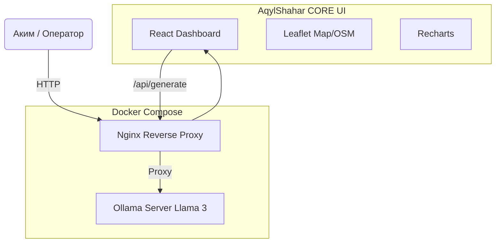

# AqylShahar CORE Platform

🚀 **AqylShahar CORE** — это предиктивная ИИ-система управления городской инфраструктурой (г. Алматы). Платформа использует локальную LLM (Ollama) и эвристические алгоритмы (Z-Score) для анализа транспортных, экологических, сейсмических метрик и предсказания критических инцидентов.

## Технологический Стек
*   **Frontend**: React (Vite), React-Leaflet, Recharts
*   **Дизайн**: Vanilla CSS, Glassmorphism 2.0 (Palantir/Bloomberg style)
*   **AI Engine**: Ollama (Llama 3)
*   **Deployment**: Docker & Docker Compose с Nginx
*   **Data Models**: Streaming API, Z-Score Anomaly Detection

## Архитектура


## Инициализация и Запуск

1. Убедитесь, что у вас установлен Docker и Docker Compose.
2. Склонируйте репозиторий и перейдите в папку.
3. Выполните запуск всей инфраструктуры:
   ```bash
   docker-compose up -d --build
   ```
   
`docker-compose` автоматически соберет продакшен-бандл (React), поднимет Nginx и сервер Ollama.
Система также попытается автоматически стянуть модель `llama3`, если её нет локально.

Система будет доступна по адресу: `http://localhost:80`

## Особенности сборки
*   **Интерактивный помощник Акима:** Реагирует в реальном времени с использованием потоковой передачи (streaming response).
*   **Режим презентации:** Доступен по `F11` или `Ctrl+P`.
*   **Экспорт отчетов:** Поддерживается выгрузка в PDF и CSV.
